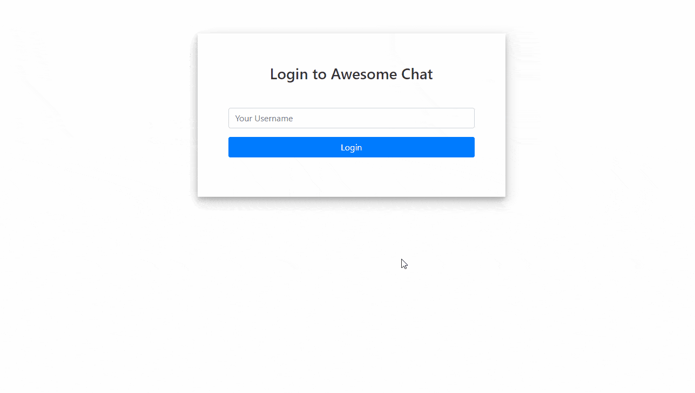
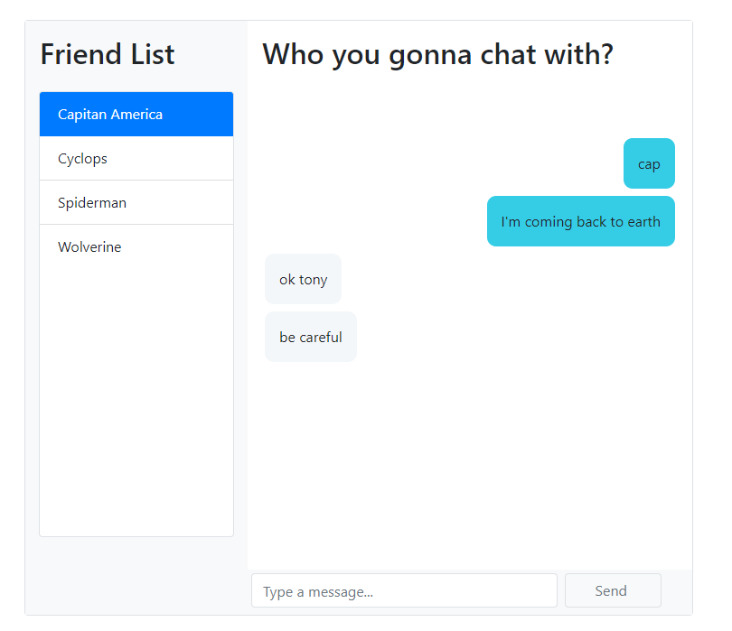

# Chat App Using React Hooks

This project shows how to build a React chat application using CometChat and React Hooks. 

SCREENSHOTS

## Useful links

* [Tutorial](https://prodocs.cometchat.com/docs/react-native-quick-start)
 
